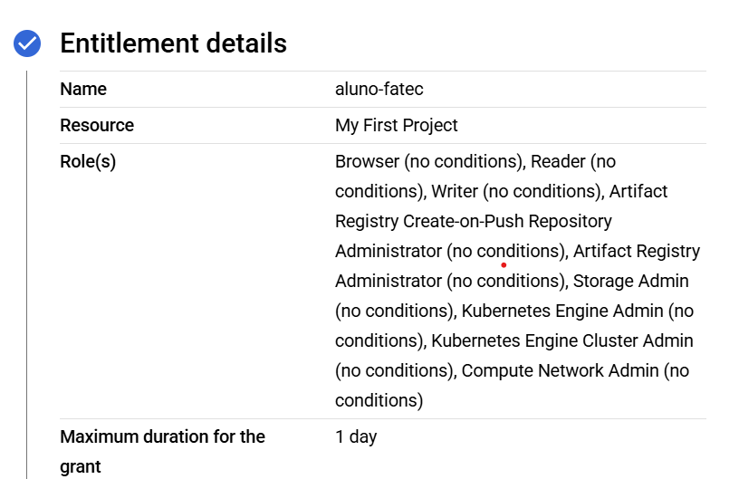

## Comandos para ajudar no Workshop

criação de container com volume
`docker run -it -v myvolume:/workspace ubuntu-fatec`

## Comandos para fazer login na gcp

### Para utilizar a conta pessoal
`gcloud auth login`

### Para utilizar uma Service Account
`gcloud auth activate-service-account --key-file=path/to/your-service-account-key.json`
`gcloud auth activate-service-account --key-file=sa.json`

## Install Nano ou Vim ubuntu

sudo apt update
sudo apt install nano
sudo apt install vim

## Alterações a serem feitas

Trocar o nome da VPC e da SUBNET para não dar conflito
`Arquivo variables.tf na pasta VPC` 

Trocar o nome do Cluster GKE, VPC e SUBNET para não dar conflito
`Arquivo variables.tf na Pasta GKE` 

### Em caso de uso da minha Service Account
Trocar o prefix para criar o arquivo terraform.state
`prefix = "<seu_nome>/gke/terraform-gke-state.tfstate"`

Caso não formos utilizar minha service account, manter o que esta no
arquivo.

`Arquivo a ser modificado: backend.tf em VPC e GKE`

### Em caso de uso de conta GCP pessoal

Trocar os valores de project = var.project_id.

Cada provider tem a mesma config.
Em `variables.tf`, trocar para o seu project_id

## Imagem to grant

$projectId = "mythic-attic-450700-r8"
$roleId = "fatec_role"
$title = "fatec_role"
$description = "Provides full permissions for Google Kubernetes Engine, Artifact Registry, and Cloud Storage"
$permissions = @(
    # Valid GKE permissions (container.* is invalid)
    "container.clusters.get",
    "container.clusters.list",
    "container.clusters.create",
    "container.clusters.update",
    "container.clusters.delete",
    "container.operations.get",
    "container.operations.list",
    "container.pods.get",
    "container.pods.list",
    
    # Valid Artifact Registry permissions (must enable API first)
    "artifactregistry.repositories.downloadArtifacts",
    "artifactregistry.repositories.uploadArtifacts",
    "artifactregistry.repositories.list",
    "artifactregistry.repositories.get",
    
    # Valid Cloud Storage permissions
    "storage.buckets.get",
    "storage.buckets.list",
    "storage.buckets.create",
    "storage.buckets.update",
    "storage.buckets.delete",
    "storage.objects.get",
    "storage.objects.list",
    "storage.objects.create",
    "storage.objects.update",
    "storage.objects.delete",
    
    # Required supporting permissions
    "resourcemanager.projects.get",
    "serviceusage.services.list",
    "serviceusage.services.use"
)

# Join permissions with commas
$permissionsString = $permissions -join ","

# First enable the required APIs
Write-Host "Enabling required APIs..."
gcloud services enable container.googleapis.com --project=$projectId
gcloud services enable artifactregistry.googleapis.com --project=$projectId
gcloud services enable storage-component.googleapis.com --project=$projectId

# Then create the role
Write-Host "Creating custom role..."
gcloud iam roles create $roleId `
    --project=$projectId `
    --title="$title" `
    --description="$description" `
    --permissions=$permissionsString `
    --stage=GA

Write-Host "Custom role created successfully!"