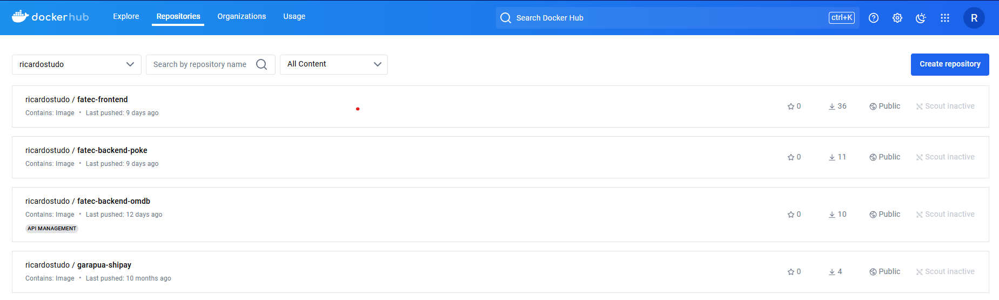

# Atividade Prática

Este documento tem como objetivo auxiliar na execução da atividade prática que os
alunos irão realizar no dia do **Tech Lab - FATEC Carapicuiba**. O auxilio se baseia
em instalar programas e ferramentas e execução de comandos para fazer a aplicação 
funcionar.

## Realizar o clone do repositório GitHub

Toda a aplicação criada está armazenada em um repositório público no GitHub.

Para realizar o clone é necessária uma conta no GitHub e ter configurado as
credenciais.

- Link do repositório: `https://github.com/RicardoGoncal/workshop-fatec`

## Instalação do Docker

O Docker será a plataforma responsável por empacotar tudo e gerar uma imagem 
para ser executada em um container(pod - kubernetes).

Para realizar a instalação siga o site oficial. Abaixo os links para cada S.O:

- Linux e derivados: `https://docs.docker.com/engine/install/ubuntu/`
- Windows e MAC necessitam baixar o Docker Desktop: `https://www.docker.com/products/docker-desktop/`

## Instalando Kubectl, Kubectx e Kubens

O kubectl é a ferramenta que faz a interação com o cluster Kubernetes. Para seu uso, é necessário
instalar em nossas máquinas.

- Link para baixar o **Kubectl**: `https://kubernetes.io/docs/tasks/tools/`

Já o Kubectx e Kubens, são plugins complementares para auxiliar na troca de cluster e namespace no kubernetes.
Devido a alguns comandos serem extensos, esses tipos de plugins ou scripts, nos auxiliam muito na hora de
realizar comandos.

- Link para baixar **Kubectx/Kubens**: `https://github.com/ahmetb/kubectx`

## Instalação do Python

O Python será a linguagem de programação utiilzada para o Tech Lab. Em sitemas Unix(Linux) geralmente ele
já vem instalado, mas pode não estar também.

- Link para Download do Python (Windows e MAC): `https://www.python.org/downloads/`
- Link para Instalação Linux: `https://python.org.br/instalacao-linux/`

## Instalação (Minikube/Kind)

O kind (Kubernetes IN Docker) é uma ferramenta que permite rodar clusters Kubernetes localmente usando contêineres Docker. Ele é útil para testar, desenvolver e realizar experimentos com Kubernetes de maneira simples, sem a necessidade de uma infraestrutura complexa.

- Pré-requisito: Ter o Docker instalado na máquina.


## Instalação do virtualenv( Lib Python)

O virtualenv é uma ferramenta que permite criar ambientes virtuais isolados para projetos Python. Isso significa que cada projeto pode ter suas próprias dependências (bibliotecas e versões de pacotes), sem interferir em outros projetos ou no sistema.

- Comando para instalar: `pip(3) install virtualenv`
- Comando para criar uma ambiente virtual: `virtualenv nome_do_ambiente`
- Comando para ativar o ambiente virtual:
    - Windows: `nome_do_ambiente\Scripts\activate`
    - Linux/Mac: `source nome_do_ambiente/bin/activate`
- Comando para desativar: `deactivate`

## Instalação do Vue.js, Node.js, npm

Vue.js é um framework JavaScript progressivo usado para construir interfaces de usuário e aplicativos web dinâmicos. Ele é focado na camada de exibição (UI) e é fácil de integrar com outros projetos. Você pode usar Vue.js para criar desde componentes simples até aplicações completas e complexas, permitindo interatividade nas páginas da web.

**Pré-requisitos: ter o Node.js e npm instalados na máquina.**
-  Verificar se existem:
    - node -v (para ver versão do node.js)
    - npm -v (para ver versão do npm)
    - Instalar node.js(Windows): `https://nodejs.org/pt`
    - Instalar node.js(Linux):
        - `curl -fsSL https://deb.nodesource.com/setup_20.x | sudo -E bash -`
        - `sudo apt install -y nodejs`
        - `sudo apt install build-essential`

## Instalar um pacote NPM

Em alguns precisamos atualizar a lista de pacotes do projeto Vue.js(node.js). Para isso, precisamos
utilizar o CLI do NPM.

Para realizar uma instalação de pacote:
    - Ir até o caminho do projeto que contem o arquivo **package.json**
    - Comando para instalar um pacote: `npm install <nome-do-pacote>`


**OBS: Pode ser que seja necessário este passo para realizar a build da imagem Docker**

## DockerHub

Explicar o que é Dockerhub .....

## Utilizando o Docker no TechLab

No laboratório iremos utilizar o Docker para criar a imagem que será aplicada em um pod
dentro do ambiente kubernetes. Para que isso seja possível, alguns passos devem ser seguidos:

- Criar um arquivo Dockerfile que conterá tudo que é necessário para criar a imagem, como:
    imagem base, comandos CLI, comandos para cópia de dados, dentre outros.

```
# Use a imagem base oficial do Python
FROM python:3.9-slim

# Defina o diretório de trabalho no contêiner
WORKDIR /app

# Copie o arquivo requirements.txt para o diretório de trabalho
COPY requirements.txt .

# Instale as dependências necessárias
RUN pip install --no-cache-dir -r requirements.txt

# Copie todo o código da aplicação para o diretório de trabalho
COPY . .

# Especifique o comando para rodar a aplicação
CMD ["python", "app.py"]

```

- Após criar o arquivo Dockerfile, na mesma pasta em que ele está contido, vamos dar alguns comandos:
    - Comando para criar a imagem local: `docker build -tag <nome-da-tag> .`
    - Comando para verificar: `docker images`

- Para executar a imagem, podemos aplicar o comando local para teste:
    - Comando para executar: `docker run -p 8080:8080 <nome-da-imagem>`

- Quando executamos via kubernetes, o mais comum é fazer um upload da imagem à um repositório. Neste caso,
    usaremos o Dockerhub.
    - Criar uma conta no docker hub.
    - Criar uma nova imagem com uma tag especifica: `docker tag <nome-da-imagem-local:latest> <nome-do-repo/nome-imagem:tag>`
    - Realizar o upload para o DockerHub: `docker push <nome-do-repo/nome-imagem:tag>`

    

**OBS: Pode ser necessário realizar login no Docker. Use o comando no terminal: `docker login`** 


## Utilizando o Kind no TechLab
